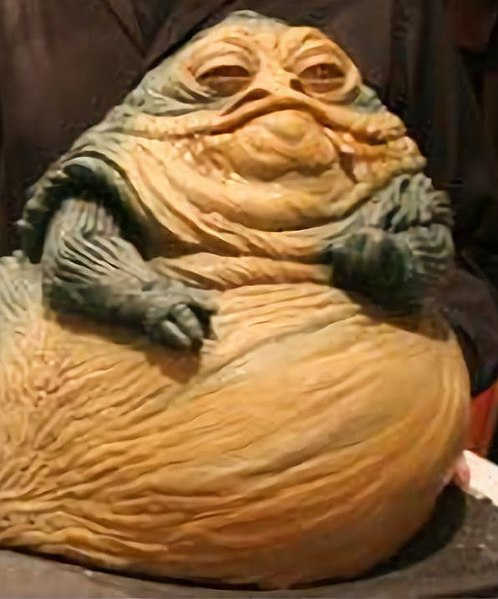

Today we are going to talk about running some basic statistics in R.

```{r}
library(tidyverse)
library(plotly)
library(cowplot)
```

Usually, when I want to run stats on a thing, I start with some basic descriptive stats. Fortunately we did this last week with the starwars dataset, so lets jump back in.

```{r}
data(starwars)
```

Lots of statistics are applied to continuous variables. Lets take a look at the relationship between height and mass.
I'm going to make an interactive plot with `ggplotly` so we can mouse over points and see them better.

Here I included a name and spec variable, but didn't map them to anything. Thats so you can see them when you mouse over them.
```{r}
hmPlot <- starwars %>% ggplot(aes(x = height, y = mass, name = name, spec = species)) + geom_point() + theme_cowplot()
ggplotly(hmPlot)
```

Woah dude. One character is anomalously heavy. 
Mouse over the outlier so you can see who it is.




Jabba is probably going to screw up all of our stats, lets focus on the relationship of all of the other charactersby removing him.

```{r}
starwars01 <- starwars %>% filter(!str_detect(name, "Jabba")) # Complecated syntac because I can't spell the rest of his name
```

```{r}
hmPlot01 <- starwars01 %>% ggplot(aes(x = height, y = mass, name = name, spec = species)) + geom_point() + theme_cowplot()
ggplotly(hmPlot01)
```

So here's our relationship. It looks sort of, but not reeally linear, which makes sense, there are lots of species in the galaxy.

Sometimes when we do stats, the stats like to imagine normally distributed data.

```{r}
starwars01 %>% pivot_longer(cols = mass:height, names_to = "measurement", values_to = "value") %>% 
  ggplot(aes(x = value)) + facet_wrap(measurement~.) + geom_histogram()
```

Hmm. Sort of.

See if you can figure out what I did above. 

Lets see if height and width are correlated.

```{r}
cor.test(starwars01$height, starwars01$mass, method = "pearson")
cor.test(starwars01$height, starwars01$mass, method = "spearman")
```

Here are a parametric and non-parametric correlation test. The values I usually think about are cor (pearson), which is the R value, or rho(spearman) which is its "rho" which is a lot like an R value.

Numbers closer to 1 are more  positively correlated, closer to -1 are more  negatively correlated, closer to 0 are not correlated. 

There is a p-value for both of these, which is essentially the probability that if all of the assumptions of the model hold, the true R or rho value is zero.

# Regressions
Regressions are also pretty popular with the kids these days. Lets do one!
Lets see how well `height` explains `mass`

```{r}
mod <- lm(mass ~ height, data = starwars01)
summary(mod)
```

Lets look at what this tells us.
Residuals are essentially the distance of each point from the models prediction. The one that is farthest below is ~ -39 too low, the highest above is ~ 57 and the median and first and third quartiles are also shown.

Coefficients are often what you care about. The estemate tells us about the slope and intercept of the linear regression. These values basically say our model looks like this

mass = -32.5 + 0.62 * height

We don't know the true values of these paramters, so the standard error gives us an idea of the ranges of the two. T-value is the test score to see how good those are, band the p-value tells you if the answer is statistically significant.

4.02 x 10^-12 < 0.002 so it the height value gets a bunch of stars after it. I usually don't make too much of the p value of the intercept.

Residual standard error is the standard deviation of the residuals, according to the internet.
56 degrees of freedom is calculated as our sample size, minus the complexity of the model.  We have 58 characters, but we loose one DF for the intercept and another for the height varaible that we are using.

There is also an R^2, and adjusted R^2 which gets smaller as the model gets more complicated, and a p-value for the whole model.

## Residuals
Linear models like to assume that the residuals are normally distributed. We want to make sure that no person is really affecting our model too much. We can plot the model to do this.

```{r}
plot(mod)
```

## Processing models

the `broom` package gives a nice matrix version of model results

```{r}
library(broom)
tidy(mod)
```


